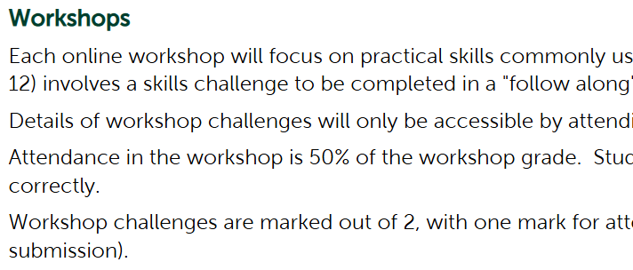

# Workshop-04

By: Matthew White

## Emphasis

Each online workshop will focus on *practical skills* commonly used in web development (version control, regular expressions, testing, etc). Each workshop (except Week 12) involves a skills challenge to be completed in a "follow along" manner.  Completing each challenge accounts for the student's workshop grade.  

Details of workshop challenges will only be _accessible by attending_ the workshop periods or watching the workshop recording (they will not be posted on Blackboard).

## Strong

Attendance in the workshop is **50% of the workshop grade**.  Students should ensure they are properly authenticated with Zoom so that their attendance is recorded correctly.

Workshop challenges are __marked out of 2__, with one mark for attendance and one mark for completing the challenge  (with 0.5 marks for a partially completed challenge submission).

## Lists

### Unordered List

- List item 1
- List item 2
    - sud item 1
    - sud item 2
- List item 3

### Ordered list

1. first item
2. second item
    1. sud item 1
    2. sud item 2
3. Third item


## Images



## Hyperinks 

[Online Syllabus System](https://www.trentu.ca/syllabus)

## Inline 

in HTML the ``


### code fence 

```html
<nav>
        <ul>
          <li><a href="index.html">Home</a></li>
          <li><a href="grid.html">Grid</a></li>
          <li><a href="https://trentu.ca">Trent</a></li>
          <li><a href="https://loki.trentu.ca">Loki</a></li>
        </ul>
      </nav>
```

```css
body {
  font-family: system-ui, -apple-system, BlinkMacSystemFont, "Segoe UI", Roboto,
    Oxygen, Ubuntu, Cantarell, "Open Sans", "Helvetica Neue", sans-serif;
  height: 100vh;
  display: flex;
  flex-direction: column;
}
```